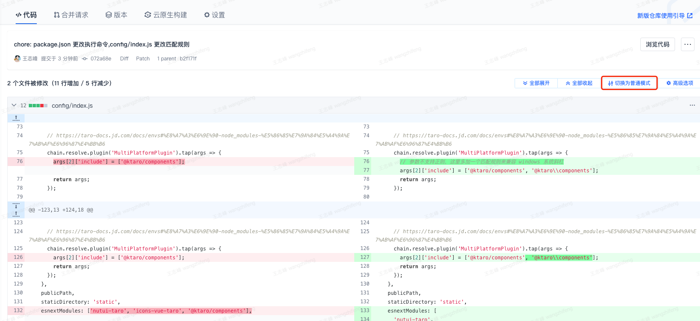

# taro + vue3+ nutui + @ktaro

# 模版更新记录

模版调整细节会在这里描述，大家针对模版的调整来进行调整业务项目，有遇到模版上的错误可以咨询王志峰。

tips：点击更新记录直接定位到 coding 的更改记录，建议设置右侧切换为左右模式方便看改动了哪里



## 2023-08-25

新增 i18n 全套解决方案相关配置

[git 详细更新记录](https://ktsoft.coding.net/p/chanpinuiyitihua/d/taro-vue3-nutui-template/git/commit/abc49e0c8461cae41b97471990185277e445df46)

## 2023-08-15

[git 详细更新记录](https://ktsoft.coding.net/p/chanpinuiyitihua/d/taro-vue3-nutui-template/git/commit/b9200f43ed8e3521a2732a3b910c4c926ce70915)

## 2023-07-31

[git 详细更新记录](https://ktsoft.coding.net/p/chanpinuiyitihua/d/taro-vue3-nutui-template/git/commit/df07c35e3fdfe9b110b4744f456121c9f295c478)

### 新增 config/index 相关配置以支持项目正常运行

#### [./config/index.js](./config/index.js#L79)

#### [./config/index.js](./config/index.js#L92)

#### [./config/index.js](./config/index.js#L150)

## 2023-07-20

[git 详细更新记录](https://ktsoft.coding.net/p/chanpinuiyitihua/d/taro-vue3-nutui-template/git/commit/85c08894a3aa80c40378bbc6114d38c68b0f4a98)

### 新增 h5 public 不纳入打包的静态资源处理

#### [./config/index.js](./config/index.js#L62)

#### [./src/index.html](./src/index.html)

支持安全区域处理

```html
<meta
  name="viewport"
  content="width=device-width, initial-scale=1.0, maximum-scale=1.0, minimum-scale=1.0, viewport-fit=cover"
/>
```

添加 favicon.ico

```html
<link rel="icon" href="<%= process.env.BASE_URL %>/favicon.ico" />
```

### [./tsconfig.json](./tsconfig.json)

```ts
"include": [
    // 包含 @ktaro/components，目前 @ktaro/components 没有进行构建打包生成产物.d.ts，不能被 component.d.s 识别，这里手动 include
    "node_modules/@ktaro/components"
],
```

### 更新 otree demo 相关

[./src/pages/demo/otree/index.vue](./src/pages/demo/otree/index.vue)

## 2023-07-13

[git 详细更新记录](https://ktsoft.coding.net/p/chanpinuiyitihua/d/taro-vue3-nutui-template/git/commit/9ab53bd149e3a92bc733c7e73eb44cc736a48601)

### 新增 @ktaro/components-resolver

[./config/index.js](./config/index.js)

解析器实现无需手动引入/无需全局注册 @ktaro/components 的组件，感兴趣可以到官网了解[unplugin-vue-components](https://github.com/antfu/unplugin-vue-components)的使用

由于额外产生的 component.d.ts 可以加入 .gitignore，避免无意义冲突

### 新增 otree 组件 demo

[./src/pages/demo/otree/index.vue](./src/pages/demo/otree/index.vue)

### 新增 kt 主题规范配置

[./src/app.scss](./src/app.scss)

主题颜色规范，后续的开发严格按照主题颜色来开发，如 div 的背景颜色为主色，不能直接使用 #xxx，要使用变量的形式来，详情看 [@ktaro/themes](https://ktsoft.coding.net/p/chanpinuiyitihua/d/ktaro/git/tree/master/packages/themes#user-content-ktarothemes)

### 新增 h5 路由配置，简化路由

[./config/index.js](./config/index.js)

如 /pages/foo/bar/index -> /foo/bar

将会去掉 头部 pages 和尾部 index

规范：严格按照小写链接符的方式来定义页面组件（迎合 Taro 规范），因为 Taro 的页面组件命名即路由，如，/pages/user-info/index，不要写成 /pages/userInfo/index
